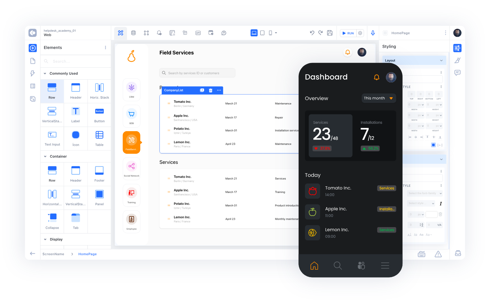

# Introduction

<figure><figcaption></figcaption></figure>

[**Kuika;**](https://platform.kuika.com/login.html?source=website) It is a cloud-based all-in-one Low-code platform that enables you to develop web and mobile applications with its Low-code (Low-code/less-code) infrastructure.

Kuika User Manual will assist you in your application development process with Kuika by conveying the functions of [**UI Design**](https://manual.kuika.com/ui-design/explore-ui-design-mode),[ **Datasources**](https://manual.kuika.com/data-sources/explore-datasources-mode), [**Process Automation**](https://manual.kuika.com/process-automation/process-automation), [**Email Builder**](https://manual.kuika.com/add-notifications/use-email-builder), [**Report Designer**](https://manual.kuika.com/report-designer/report-designer), [**Scheduled Jobs**](https://manual.kuika.com/scheduled-jobs/scheduled-jobs), [**API Builder**](https://manual.kuika.com/api-builder/api-builder), [**Configuration Manager**](https://manual.kuika.com/create-your-application/what-is-config-manager) and [**Helpdesk**](https://manual.kuika.com/beginning/learn-the-app-development-process-on-kuika/get-help-with-helpdesk) view modes. In the Kuika user manual;

* [**UI Design**](https://manual.kuika.com/ui-design/explore-ui-design-mode) (Interface design with drag-and-drop elements)
* [**Datasources**](https://manual.kuika.com/data-sources/explore-datasources-mode) (Adding and managing data sources to the application)
* [**Process Automation** ](https://manual.kuika.com/process-automation/process-automation)(Designing and managing workflows),
* [**Email Builder**](https://manual.kuika.com/add-notifications/use-email-builder) (Prepare Email designs to be sent to users of the application you have developed),
* [**Report Designer** ](https://manual.kuika.com/report-designer/report-designer)(Designing reports in web applications)
* [**Scheduled Jobs**](https://manual.kuika.com/scheduled-jobs/scheduled-jobs) (Adding scheduled jobs within the application)
* [**Configuration Manager** ](https://manual.kuika.com/create-your-application/what-is-config-manager)(Configuration settings profiles to be used in testing and publishing processes of the application you have developed as Web, iOS and Android)
* [**API Builder**](https://manual.kuika.com/api-builder/api-builder) (Using the developed application as a data source for different applications)
* [**Helpdesk** ](https://manual.kuika.com/beginning/learn-the-app-development-process-on-kuika/get-help-with-helpdesk)(Enable users to create support requests within the platform)

definitions and usage methods of view modes are explained in detail.

You can also access basic concepts and training content for application development that you will need in an application development process.

It is enriched with supporting content such as Basic Concepts, Project analysis process, UI/UX design, SQL and Queries preparation.

* Basic Concepts,
* Project analysis process,
* [**UI/UX design**](https://manual.kuika.com/courses/ui-ux-design),
* [**SQL and Queries preparation.**](https://manual.kuika.com/courses/working-with-sql-and-queries/introduction-to-sql/sql-basic)

#### Usage and content list of Kuika Manual 

You can find the main headings of the user guide that will help you develop an application from scratch with Kuika from the list on the left. When using our user guide;

* The content list and subheadings that appear on the left side on the web and open with the menu on mobile are listed in accordance with your application development process in Kuika.
* You can search the manual's content with the search field in the upper right corner.


When you need help, you can use the [**Helpdesk**](https://manual.kuika.com/beginning/learn-the-app-development-process-on-kuika/get-help-with-helpdesk) view within the [**Platform**](https://platform.kuika.com/login.html?source=website).

